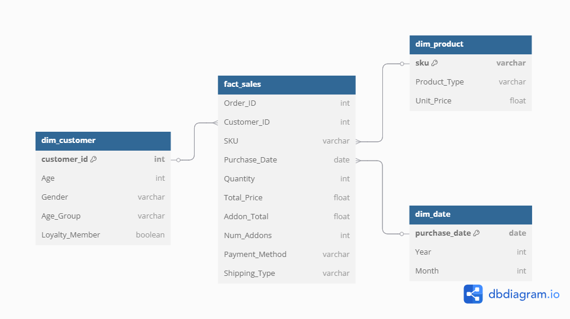
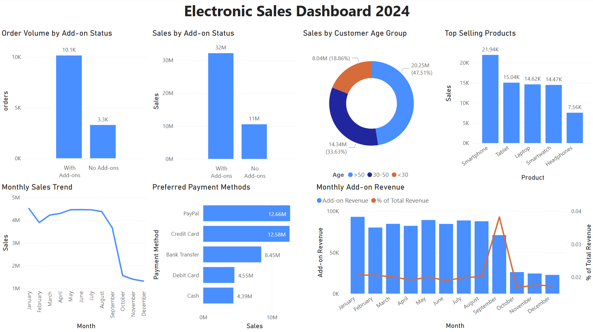

# 🛍️ Electronic Sales Data Pipeline & Dashboard (2024)

This project demonstrates a complete end-to-end data analytics workflow, from raw data preprocessing to business intelligence reporting, using Python, SQL, and Power BI. It analyzes electronic sales data to generate insights into customer behavior, product performance, add-on usage, and sales trends.

## 📦 Dataset

- **Source**: [Kaggle - Electronic Sales Sep 2023 to Sep 2024](https://www.kaggle.com/datasets/cameronseamons/electronic-sales-sep2023-sep2024?resource=download)
- 20,000 rows of customer transactions
- Includes fields like product types, pricing, add-ons, payment method, customer age/gender, loyalty status, and purchase date

---

## 🧪 Project Overview

| Step | Description |
|------|-------------|
| 🔹 **Data Cleaning** | Cleaned and enriched raw data with pandas, including date conversion, age binning, and add-on parsing |
| 🔹 **Database Modeling** | Created a SQLite database with star schema: `fact_sales`, `dim_customer`, `dim_product`, and `dim_date` |
| 🔹 **SQL Analytics** | Wrote 9+ SQL queries to analyze monthly sales, top products, add-on revenue, customer segmentation, etc. |
| 🔹 **Export for BI** | Exported query results to Excel to be used by Power BI |
| 🔹 **Dashboard** | Built a Power BI dashboard to visualize key business metrics and trends |

---

## 🧱 Star Schema



- `fact_sales`: Sales fact table (quantities, prices, add-ons)
- `dim_customer`: Customer demographics and loyalty info
- `dim_product`: SKU, product types, pricing
- `dim_date`: Purchase date with year/month breakdown

---

## 📊 Power BI Dashboard Preview



The dashboard includes:
- Monthly sales trends
- Add-on vs non-add-on revenue analysis
- Sales by customer age group
- Top selling products
- Add-on share over time
- Preferred payment methods

---

## 🛠 Tech Stack

- **Python**: pandas, sqlite3, openpyxl
- **SQL**: SQLite (via pandas + raw SQL scripts)
- **Power BI**: DAX, chart design, dynamic filters
- **Excel**: As data connector from SQL to BI
- **Tools**: Git, GitHub, dbdiagram.io (for ERD)

---

## 🚀 How to Run

1. Clone this repo
2. Install dependencies:
   ```bash
   pip install pandas openpyxl
3. Run scripts in order:
   ```bash
   python electronic_sales_data_to_clean.py
   python electronic_sales_data_to_db.py
   python electronic_sales_data_to_db_to_excel.py
4. Open `sales_query_results.xlsx` in Power BI or Excel
5. Explore the Power BI dashboard `electronic_sales_dashboard.pbix`

## 📌 Highlights

- End-to-end data pipeline covering data cleaning, modeling, SQL analytics, and BI dashboard
- Star schema database design for efficient querying and reporting
- Insightful Power BI visualizations for business users
- Clean, modular code structure for reproducibility and reuse
